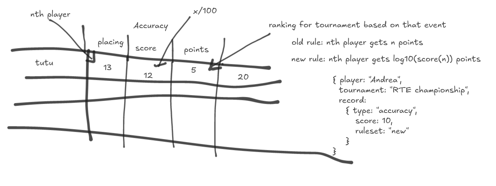

Boomerang Tournaments
=====================

- Learn how to make tests in Elm
- backend required?

##### MVP

- be able to handle one tournament (without db)
  - ability to create/name the tournament
  - ability to add players to a tournament
    - name
    - category (male<>female/junior<>senior<>veteran)
  - Add score for tournament events 
    - automated scoring calculation 
    - 6 types of events in the tournament 
      - accuracy
      - fast catch
      - endurance
      - MTA
      - Australian round
      - trick-catch
  - have a way to save/export the data
  - have a way to edit entries

##### Business rules

